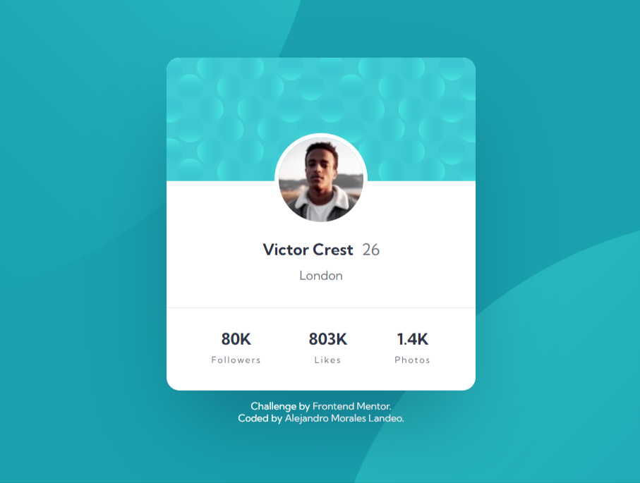
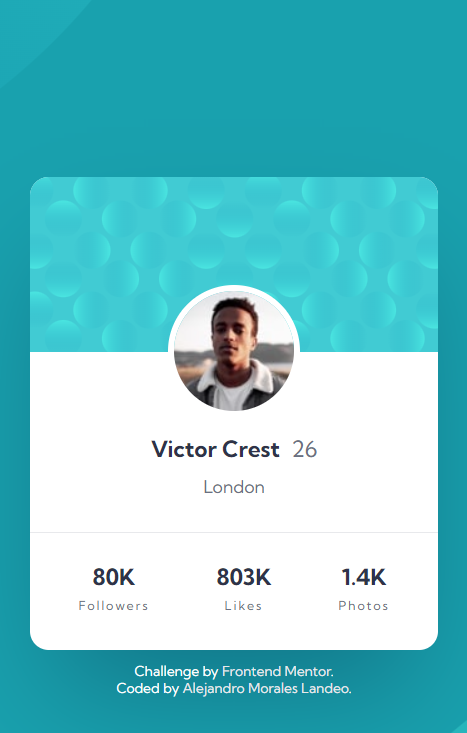

# Frontend Mentor - Profile card component solution

This is a solution to the [Profile card component challenge on Frontend Mentor](https://www.frontendmentor.io/challenges/profile-card-component-cfArpWshJ). Frontend Mentor challenges help you improve your coding skills by building realistic projects. 

## Table of contents

- [Overview](#overview)
  - [The challenge](#the-challenge)
  - [Screenshot](#screenshot)
  - [Links](#links)
- [My process](#my-process)
  - [Built with](#built-with)
  - [What I learned](#what-i-learned)
- [Author](#author)
- [Acknowledgments](#acknowledgments)

## Overview

### The challenge

- Build out the project to the designs provided

### Screenshot
Desktop preview:

Responsive:

Mobile preview:

### Links

- Solution URL: [Repository](https://github.com/amoraleslandeo/Profile-card-component-coding-challenge.github.io)
- Live Site URL: [Web page](https://amoraleslandeo.github.io/Profile-card-component-coding-challenge.github.io/)

## My process

### Built with

- Semantic HTML5 markup
- SCSS 
- Flexbox

## Author

- Website - [Alejandro Morales Landeo](https://github.com/amoraleslandeo)
- Frontend Mentor - [@amoraleslandeo](https://www.frontendmentor.io/profile/amoraleslandeo)

## Acknowledgments

I wanna say thanks to my daily support [Roberto](https://github.com/RobertoSilvaZ) 🙌😉 who has become my developer Mentor and guide through this process that is just beggining.

